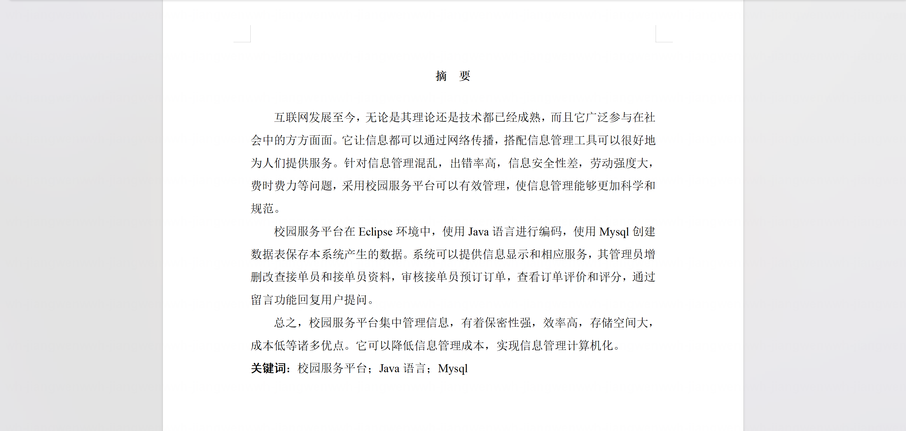
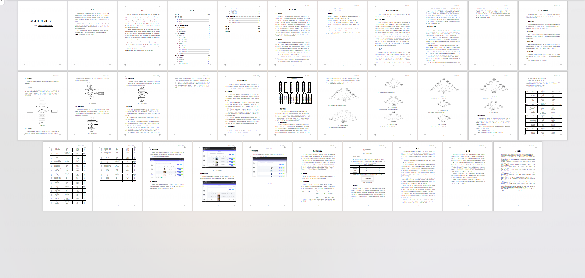
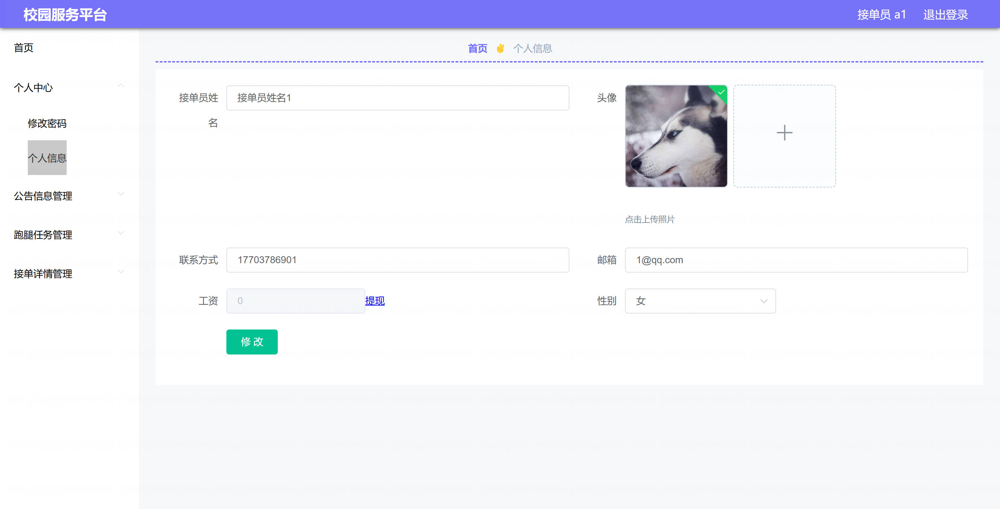
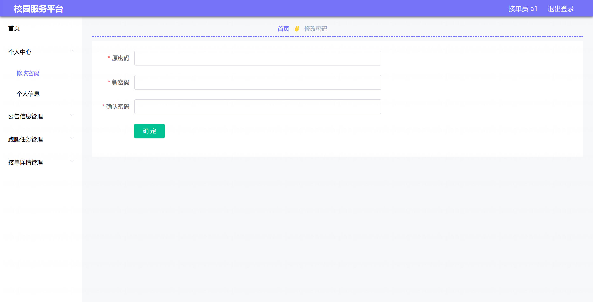
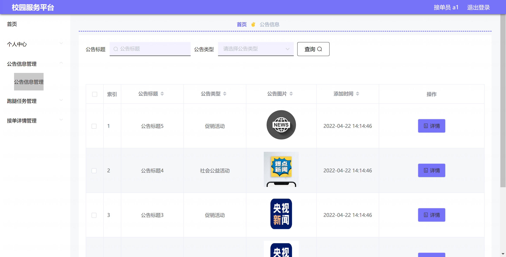
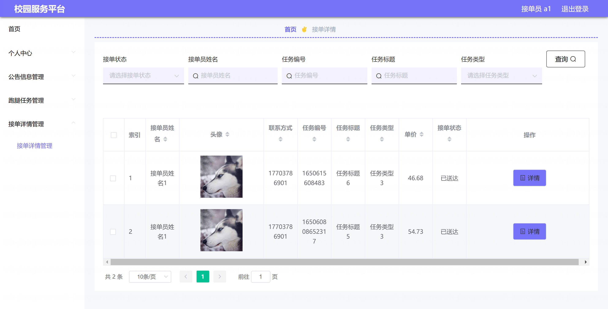
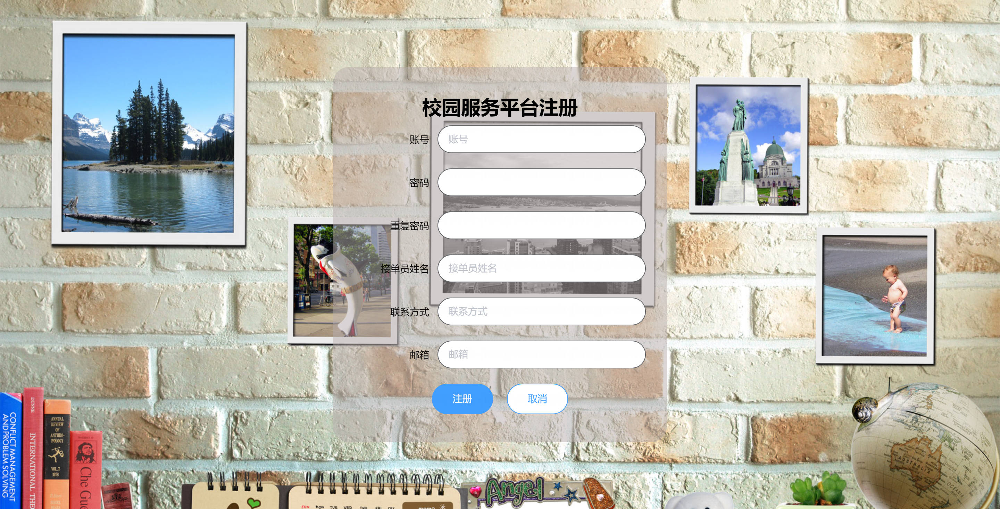
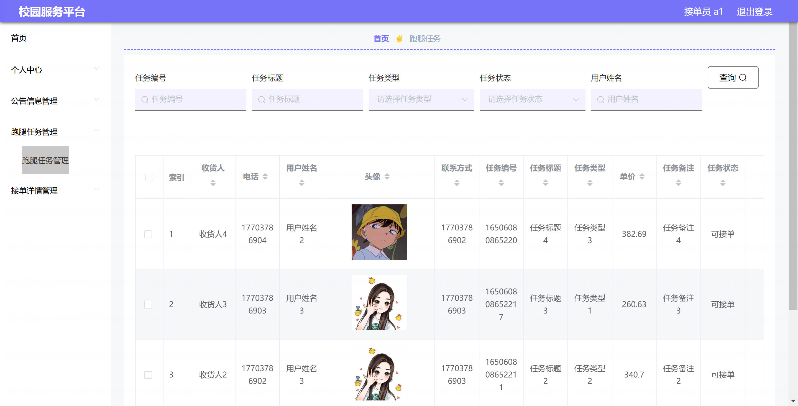
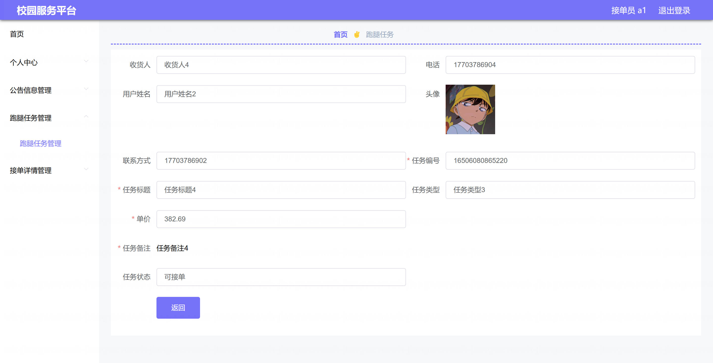
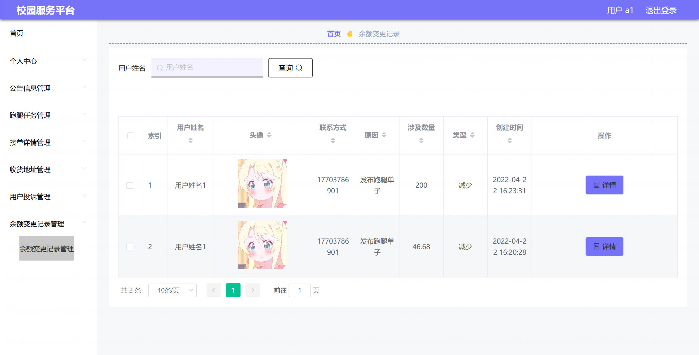

基于Springboot的校园服务平台（B/S 架构）（程序+论文）
=

### 完整代码获取地址：从戎源码网 ([https://armycodes.com/](https://armycodes.com/))
### 作者微信：19941326836  QQ：952045282 
### 承接计算机毕业设计、Java毕业设计、Python毕业设计、深度学习、机器学习
### 选题+开题报告+任务书+程序定制+安装调试+论文+答辩ppt 一条龙服务
### 所有选题地址https://github.com/nature924/allProject

一、项目介绍
---

基于 Spring Boot 的校园服务平台（B/S 架构），系统面向三类主要角色：管理员、接单员、用户。项目已实现的功能模块及主要操作如下：

管理员（后台管理）
基本操作：登录、修改密码、获取/修改个人信息、登出
用户管理：查看/筛选用户、添加用户、修改用户、删除用户、
任务管理（跑腿任务）：分页列表、查看详情、新增/修改/删除任务、、审核/管理任务状态
接单员管理：查看/筛选接单员、查看详情、管理接单员信息
收货地址管理：查看/新增/修改/删除收货地址（与任务关联）
余额与账变：查看用户余额、余额变更记录
公告管理：公告（新闻）CRUD
投诉管理：用户投诉的查看/处理/删除

接单员
基本操作：登录、修改密码、获取/修改个人信息
任务查看与接单：查看待接/已接任务列表、查看任务详情、接单/处理任务、修改任务状态
查看与管理接单相关明细（接单详情模块）
查看用户投诉与公告

用户
账号操作：注册、登录、密码重置、获取 session 信息
发布跑腿任务：填写任务、选择收货地址、支付任务金额（系统检查余额并扣款）
任务查询：查看我的任务列表、详情、申请/撤销等
收货地址管理：新增/修改/删除地址
投诉与反馈：提交投诉、查看投诉处理状态

二、项目技术
---
- 编程语言：Java
- 数据库：MySQL
- 项目架构：B/S架构
- 前端技术：JSP
- 后端技术：Spring、SpringMVC、MyBatis

三、运行环境
---
- 操作系统：Windows、macOS都可以
- JDK版本：JDK1.8以上都可以
- 开发工具：IDEA、Ecplise、Myecplise都可以
- 数据库: MySQL5.7以上都可以
- Tomcat：任意版本都可以
- Maven：任意版本都可以

四、运行截图
---
### 论文截图：

### 程序截图：

